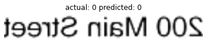
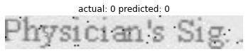
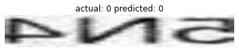
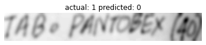
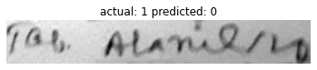

# Handwritten and Printed Text Classification for Doctor's Prescription

# How to use this repo:
- To prepare and preprocess the data in data folder run. Running this will create training data in the
data folder named training_data.npy
```
prepare_data.py
```
- To train the model run:
```
train.py
```
This will save the trained model in model directory.

- To check performance of the trained model run:
```
test.py
```
 - For inference run:'
```
inference.py
```
# Demo:
###   label 1 = Handwritten text and label 0  = Printed Text












